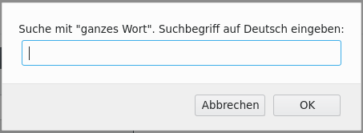

## Bookmarklets für die Seite https://dolnoserbski.de/dnw/ (Deutsch->Niedersorbisch) und https://dolnoserbski.de/ und https://dolnoserbski.de/ndw/ (Niedersorbisch->Deutsch)

Wie funktioniert das?
- Im Browser ein neues Lesezeichen so erstellen, dass es in der Lesezeichenleiste des Browsers erscheint.
- Einen Namen eingeben.
- Bei "Adresse" die komplette Zeile ab "javascript" einfügen
- Fertig

Jetzt ist folgendes damit möglich:
1. Wenn nur das Lesezeichen angeklickt wird geht ein kleines Fenster auf in dem das zu suchende Wort eingegeben werden kann.
2. Es kann ein Wort im Browser markiert werden, dann wird auf das Lesezeichen geklickt und es wird ein neuer Tab im Browser
   geöffnet und die Suche nach dem zuvor markierten Wort startet sofort.

Ein Erklärvideo als [schnelle Version](https://github.com/Koala/WendischThemen/blob/master/Bookmarklet/vid_schnell-bookmarklet_1280x720.mp4?raw=true) oder als [langsame Version](https://github.com/Koala/WendischThemen/blob/master/Bookmarklet/vid_langsam-bookmarklet_1280x720.mp4?raw=true).

Achtung! Beide Versionen sind rund 21 MB groß! Nur download, kein direktes Abspielen hier möglich ist.

Getestet mit Firefox Version 76.0 - 30.04.2020

## Deutsch-Niedersorbisches Wörterbuch

https://dolnoserbski.de/dnw/suche?wuraz=auto&pozicija=lema

**Lemma**
```
javascript:s=document.getSelection();if(!s||s==%27%27){void(s=prompt(%27Suche%20mit%20"Lemma"%20(Grundform).%20Suchbegriff%20auf%20Deutsch%20eingeben:%27,%27%27))};if(s){w=open(%27https://dolnoserbski.de/dnw/suche?wuraz=%27+encodeURIComponent(s)+%27&pozicija=lema%27,%27%27,%27%27);w.focus();}
```

https://dolnoserbski.de/dnw/suche?wuraz=auto&pozicija=s%C5%82owo

**ganzes Wort**
```
javascript:s=document.getSelection();if(!s||s==%22%22){void(s=prompt(%27Suche%20mit%20"ganzes%20Wort".%20Suchbegriff%20auf%20Deutsch%20eingeben:%27,%27%27))};if(s){w=open(%27https://dolnoserbski.de/dnw/suche?wuraz=%27+encodeURIComponent(s)+%27&pozicija=s%C5%82owo%27,%27%27,%27%27);w.focus();}
```

https://dolnoserbski.de/dnw/suche?wuraz=auto&pozicija=zachopje%C5%84k

**Wortanfang**
```
javascript:s=document.getSelection();if(!s||s==%22%22){void(s=prompt(%27Suche%20mit%20"Wortanfang".%20Suchbegriff%20auf%20Deutsch%20eingeben:%27,%27%27))};if(s){w=open(%27https://dolnoserbski.de/dnw/suche?wuraz=%27+encodeURIComponent(s)+%27&pozicija=zachopje%C5%84k%27,%27%27,%27%27);w.focus();}
```

https://dolnoserbski.de/dnw/suche?wuraz=auto&pozicija=srjedk

**im Wort**
```
javascript:s=document.getSelection();if(!s||s==%22%22){void(s=prompt(%27Suche%20"im%20Wort".%20Suchbegriff%20auf%20Deutsch%20eingeben:%27,%27%27))};if(s){w=open(%27https://dolnoserbski.de/dnw/suche?wuraz=%27+encodeURIComponent(s)+%27&pozicija=srjedk%27,%27%27,%27%27);w.focus();}
```

https://dolnoserbski.de/dnw/suche?wuraz=auto&pozicija=k%C3%B3%C5%84cowka

**Wortende**
```
javascript:s=document.getSelection();if(!s||s==%22%22){void(s=prompt(%27Suche%20"am%20Wortende".%20Suchbegriff%20auf%20Deutsch%20eingeben:%27,%27%27))};if(s){w=open(%27https://dolnoserbski.de/dnw/suche?wuraz=%27+encodeURIComponent(s)+%27&pozicija=k%C3%B3%C5%84cowka%27,%27%27,%27%27);w.focus();}
```

## Dolnoserbsko-nimske słowniki

**verbesserte Suchfunktion für sorbische Wörter**  
Bei dieser Suche sind auch mehrere Suchbegriffe mit einer Suche möglich.  
https://dolnoserbski.de/ortografija/slownik  
```
javascript:s=document.getSelection();if(!s||s==%22%22){ void(s=prompt(%27Suchbegriff%20auf%20Sorbisch%20eingeben:%27,%27%27));};if(s){w=open(%27https://dolnoserbski.de/ortografija/slownik?wuraz=%27+encodeURIComponent(s),%27%27,%27%27);w.focus();}
```


https://dolnoserbski.de/ndw/pytanje?slownik=*&psistup=serbski&pisanje=originalne&pozicija=slowo

**genaue Suche (alle Bücher, Niedersorbisch, Original, Suche ganzes Wort)**
```
javascript:s=document.getSelection();if(!s||s==%22%22){void(s=prompt(%27Suchbegriff%20auf%20Sorbisch%20eingeben:%27,%27%27));};if(s){w=open(%27https://dolnoserbski.de/ndw/pytanje?wuraz=%27+encodeURIComponent(s)+%27&slownik=*&psistup=serbski&pisanje=originalne&pozicija=slowo%27,%27%27,%27%27);w.focus();}
```

https://dolnoserbski.de/ndw/pytanje?slownik=*&psistup=serbski&pisanje=originalne&pozicija=srjedk

**ungenaue Suche (alle Bücher, Niedersorbisch, Original, Suche im Wort)**
```
javascript:s=document.getSelection();if(!s||s==%22%22){void(s=prompt(%27"Ungenaue%20Wortsuche".%20Suchbegriff%20auf%20Sorbisch%20eingeben:%27,%27%27));};if(s){w=open(%27https://dolnoserbski.de/ndw/pytanje?wuraz=%27+encodeURIComponent(s)+%27&slownik=*&psistup=serbski&pisanje=originalne&pozicija=srjedk%27,%27%27,%27%27);w.focus();}
```

## Grammatische Übersicht

**Grammatische Übersicht**  
Hier muss im Suchfeld eine Zahl zwischen 1 und 106 eingegeben werden. Sonderfälle sind auf einer extra Seite zu finden. Dabei wird die Zahl um den Buchstaben "a" erweitert. z.B. 70a, 72a ...  
Es gibt weitere Aufteilungen. z.B. bei 74 gibt es 74a bis 74h.  

```
javascript:s=document.getSelection();if(!s||s==%22%22){ void(s=prompt(%27Nummer%20für%20Grammatische%20Übersicht%20eingeben:%27,%27%27));};if(s){w=open(%27https://dolnoserbski.de/dnw/grammatik/%27+encodeURIComponent(s),%27%27,%27%27);w.focus();}
```


## Beispiel

### Link erstellen:


### die Eingabe:




Kurzlink: https://t1p.de/DNS-Bookmarklets
