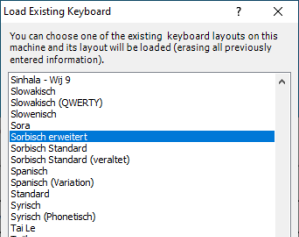
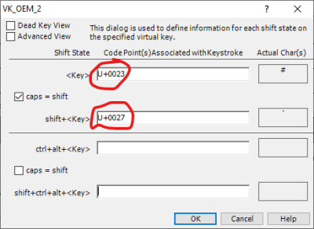
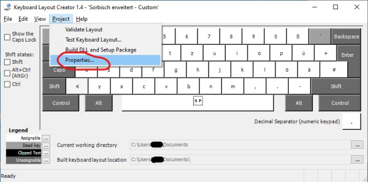
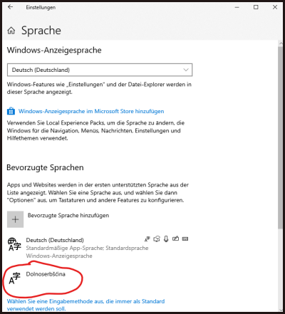
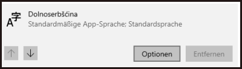
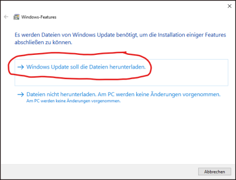

## |\\| **[Startseite](README.md)** |X| **[Smartphone](Smartphone.md)** |X| **[Linux](Linux.md)** |/|  

# Windows

## Windows 10

Externer Link!  
Der Inhalt bezieht sich auf Obersorbisch. Die Verfahrensweise gilt aber ebenso für Niedersorbisch.  
[Sorbische Tastatur für Windows 10](https://domizna.org/index.php?id=3187)

## Windows 7

Sollte nicht mehr verwendet werden. Aber wer es noch einsetzt ...

Externer Link!  
Der Inhalt bezieht sich auf Obersorbisch. Die Verfahrensweise gilt aber ebenso für Niedersorbisch.  
[Sorbische Tastatur für Windows 7](https://domizna.org/index.php?id=2046)

---

## Windows 10 - alternative Möglichkeit

Getestet mit Windows 10 - Version 1909  

Mit Hilfe des Programmes [Microsoft Keyboard Layout Creator 1.4](https://www.microsoft.com/en-us/download/details.aspx?id=22339) (kurz: **MKLC**) ist es möglich, ein Tastaturlayout an seine eigenen Bedürfnisse anzupassen.  

An diesem Beispiel möchte ich zeigen, wie die Tastatur so angepasst werden kann, dass die Buchstaben **ł** und **Ł** über die Taste **l** bzw. **L** erreichbar sind und die Taste **#** ihre Funktion behält. Das **ł** bei der Taste **l** zu finden empfinde ich einfach viel intuitiver und es passt besser zum Layout unter [Linux](Linux.md).  

### Vorab:
Das fertige Layout befindet sich hier: [Layout_SorbischAngepasst](files/Layout_SorbischAngepasst.7z).  
Die Quelldatei, zum Import in den MKLC befindet sich hier: [Layout_SorbischAngepasst_Source](files/Layout_SorbischAngepasst_Source.klc).  

### Los gehts
Das Programm [Microsoft Keyboard Layout Creator 1.4](https://www.microsoft.com/en-us/download/details.aspx?id=22339) downloaden:  

  

und starten:  

  

Es kann sein, dass es noch eine Warnung wegen fehlendem **.NET Framework Version 2.0.50727** gibt:  

  

Wie du das beheben kannst, findet du hier (weiter unten): [.NET Framework nachinstallieren](#.NET_Framework_nachinstallieren)  

Den Installationprozess in 3 Schritten durchgehen:  

  

Dann das Programm starten:  

 

Als erstes muss das benötigte Tastaturlayout geladen werden (Sorbisch erweitert):  

 

Klicke das **l** an und klicke dann auf **All**:  

 

Im folgenden Fenster trage im unteren Bereich bei **ctrl+alt+\<Key>** ein **U+0142** ein und
bei **Shift+ctrl+alt+\<Key>** ein **U+0141**. Angezeigte Zeichen rechts sind dann **ł** und **Ł**.    

So, jetzt noch den Tasten **#** und **'** wieder zu ihren Ausgaben verhelfen.
Das gleiche Vorgehen wie zuvor.  

Taste anklicken, dann auf **All** und im Fenster dann die Änderungen vornehmen.  
Bei **\<Key>** trage ein **U+0023**, bei **shift+\<Key>** trage ein **U+0027**:  

Nun können die neuen Einstellungen getestet werden. Dazu im Menü **Project/Test Keyboard Layout...** auswählen.  

Im darauf folgenden Fenster kann munter drauf losgeschrieben werden:  

Wenn alles gut war, müssen noch ein paar Einstellungen vorgenommen werden.
Öffne die Einstellungen im Menü unter **Project/Properties...***:  

Hier kann nun ein Projekt-Name vergeben werden. Unter **Description** steht die Bezeichnung, mit der später die Tastatur in den Windowseinstellungen gefunden werden kann. **Company** und **Copyright** kann nach belieben befüllt oder leer gelassen werden.  
**WICHTIG** ist die Einstellung bei **Language**. Hier muss von **Upper Sorbian (Germany)** auf **Lower Sorbian (Germany)** umgestellt werden. Rechts steht dann **DS**.

Wenn das alles fertig ist, dann geht es jetzt an die Erstellung der DLL.  
Starte mit dem Menü **Project/Build DLL and Setup Package** den Build Prozess:  

Danach erscheint eine Meldung die uns fragt, ob wir uns das Log ansehen wollen. Wollen wir aber nicht.  

Nach dem das Layout generiert wurde, kann die nächste Frage dann mit "Ja" beantwortet werden.  

Im sich öffnenden Verzeichnis das Setup zur Installation starten und fertig wäre der erste Teil.  

Jetzt noch ein paar Einstellungen zur Sprache in den Windows eigenen Einstellungen. Öffne die Windowseinstellungen und gibt in das Suchfeld **sprache** ein; wähle dann **Sprache und Tastaturoptionen ändern** aus.   

Im unteren Bereich sollte **Dolnoserbšćina** zur Auswahl stehen. Das einmal anklicken und mit einmal Klick auf den Pfeil nach (ganz) oben verschieben.  

 

Als nächstes **Optionen** anklicken. Hier sollte unter **Tastaturen** unsere neue Tastatur zu sehen sein. In meinem Fall ist es **Sorbisch erweitert - Custom**    

 

... und rechts untem im Systemtray erscheint nun der Sprachumschalter mit vorausgeähltem **DSB**.  

# # # # # # # # # # # # #   
#### # # # # E N D E # # # #  
# # # # # # # # # # # # #  

---
### .NET Framework nachinstallieren

[Anleitung auf Englisch](https://answers.microsoft.com/en-us/windows/forum/windows_10-hardware/microsoft-keyboard-layout-creator-14-instalation/092881f1-470b-4a66-889f-59e868c6b25a?auth=1)

- drücke die Taste **Windows Logo**+**R**
- gib **appwiz.cpl** ein und drücke **Enter**:  

  
- im erscheinenden Fenster klicke links den Link **Windows-Feature aktivieren oder deaktivieren** an:  

  
- markiere das Kästchen neben **.NET Framework 3.5**:  

  

- mit OK bestätigen und Windows die notwendigen Dateien automatisch herunterladen lassen:  

- danach kann das Programm erneut gestartet werden  
